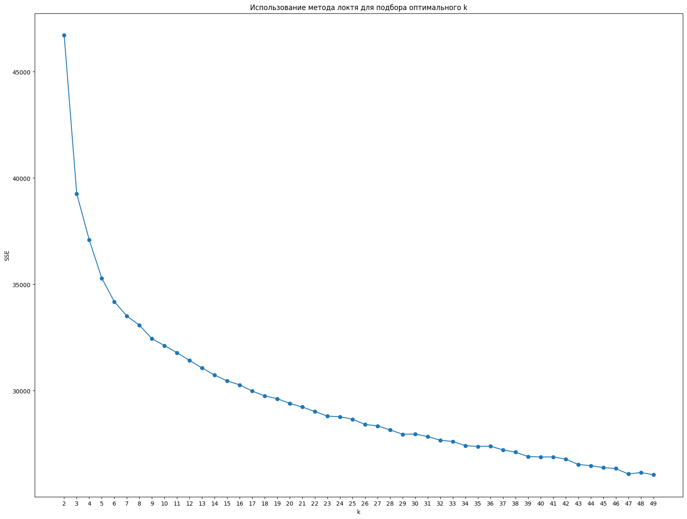

# Матчинг описания вакансий и резюме

Наш проект посвящён созданию поисковой системы, которая по входному резюме находит наиболее подходящие варианты вакансий из сохранённых в базе.

## Постановка бизнес-задачи

**Кому и как это может полезным?**

- улучшение поиска вакансий соискателями
- более оптимальная рекомендация вакансий на соответствующих платформах

## ML-решение

### Общий пайплайн

Для вакансий и резюме строятся их векторные представления одинакой размерности на основе наиболее важных текстовых признаков, после чего пара векторов вакансии и резюме сравнивается метрикой близости на сходство.

Оценить качество эмбеддингов можно несколькими способами. Один из таких способов - оценка метрики качества обученной модели, решающей задачу.

В нашем случае для оценки качества векторного представления текстов решается задача кластеризации. Помимо этого, формирование кластеров вакансий ускорит процесс поиск: вместо того, чтобы сравнивать входное резюме со всеми вакансиями, мы будем находить ближайший к эмбеддингу входного резюме кластер с вакансиями и в качестве результатов поиска будем выдавать несколько примеров вакансий из этого кластера.

Недостаток нашего подхода в том, что задача кластеризации - задача обучения без учителя и сама по себе некорректно поставлена: трудно строго определить, какая образованная совокупность кластеров лучше. В основном это определяется для конкретной задачи и эмпирическим путем.

### Используемые данные

В качестве данных мы использовали:

1. готовый датасет с вакансиями с сайта "Работа России" (датасет №3 по ссылке: [datasets](https://trudvsem.ru/opendata/datasets)): для формирования базы вакансий использовали только те вакансии, в которых заполнены поля с навыками и требованиями по знанию языков. Из этих вакансий в итоге было взято 1000 примеров.
2. собранный нами (с помощью API hh.ru) датасет резюме. \
Опишем подробнее процесс подготовки датасета:
    - При подготовке датасета вакансий и резюме из hh.ru команда столкнулась с проблемой парсинга информации. Если, для поиска вакансий, сервис предоставляет бесплатный API, то, для сбора данных о резюме, необходимо иметь аккаунт работодателя и оплатить доступ к платному API резюме. Поэтому, для сбора данных, был взят за основу [репозиторий](https://github.com/kate-red/HH_parcer), подготовленный для поиска информации об актуальных резюме, и доработан для нужд команды. 
    - Алгоритм, используемый в данном примере, скачивает HTML страницы, с актуальным списком резюме, для локального доступа к ним. 
    - После, в коде данных страниц ищутся специализированные id резюме, с помощью которых осуществляется их актуализация и хранение в сервисе hh.ru. 
    - Затем, с помощью этих индивидуальных номеров, идёт обращение к сервису для скачивания HTML-страниц, непосредственно, самих резюме.
    - И только потом, происходит скраппинг информации о каждом человеке, оставившем свою информацию на сервисе hh.ru.
    
    Таким образом, собраная информация интерпритируется в CSV-файл, хранящий в себе всю необходимую информацию: id, название резюме, город проживания человека, возраст, пол, род занятий, желаемый заработок, опыт работы, уровень образования, владение языками, полезные навыки, информация о себе.
    - [Ссылка](https://github.com/DL-teammm/matching_resumes_with_vacancies/tree/main/Datasets) на собранный датасет резюме
    - [Ссылка](https://github.com/DL-teammm/matching_resumes_with_vacancies/tree/main/notebooks/scraping_datraset) на код
   <div class="row" style="display: flex;">
      <div class="column" style="display: flex; padding: 5px;">
            
      </div>
    </div>

### Проведённые эксперименты

Были рассмотрены несколько методов векторизации текстов для построения эмбеддингов резюме и вакансий:

1. TF-IDF:
    - из данных были выделены наиболее важные столбцы (должность, навыки, знание языков, город и т.п.);
    - текстовые данные были предобработаны: удалены стоп-слова, все токены были приведены к начальной форме и т.д.;
    - по каждому из выделенных столбцов были посчитаны tf-idf коэффициенты и построены эмбеддинги;
    - в качестве итогового эмбеддинга вакансии или резюме была взята конкатенация полученных эмбеддингов по отдельных столбцам.
  
2. FastText:
    - из данных были выделены наиболее важные столбцы (название професии, сфера деятельности, навыки, знание языков, город, образование и т.п.);
    - для каждой строки все текстовые поля были объединены в одно предложение (документ), которое затем было предобработано: выполнена нормализация, обработаны опечатки, удалены стоп-слова, выполнена лемматизация слов;
    - была использована предобученная на русских текстах модель FastText с размерностью векторов 300;
    - проведена векторизация полученных документов.
3. ruBERT: \
Текст вакансий предобрабатывается методом, схожим для подхода FastText:
    - выделяются важные столбцы, происходит очистка html тегов, извлекается информация из json полей, удаляются лишние пробелы, заполняются пропуски в данных
    - После чего используется tokenizer модели ruBERT, предобученной на большом массиве текстов на русском языке
    - Полученные токены отправляются в модель и в качестве эмбеддинга для текста вакансии используется усредненный вектор предпоследнего скрытого слоя размера 768

    Стоит заметить, что у модели присутствует ограничение на количество входных токенов (максимум 512), поскольку она использует позиционное кодирование.

Для каждого из этих подходов была проведена кластеризация векторов вакансий при помощи метода K-Means.

Для сравнения качества построенных разными подходами эмбеддингов были построены графики метрик качества (при варьировании параметра k -- числа классов) для задачи кластеризации: внутрикластерная дисперсия (SSE) и индекс Девиса-Булдина. Полученные графики представлены ниже:

1. TF-IDF:
    <div class="row" style="display: flex;">
      <div class="column" style="display: flex; padding: 5px;">
            
      </div>
    </div>

    <div class="row" style="display: flex;">
      <div class="column" style="display: flex; padding: 5px;">
            
      </div>
    </div>
    К сожалению, этот подход сработал не очень хорошо на наших данных: при дальнейшей кластеризации построенных эмбеддингов вакансий внутри кластеров было много примеров разрозненных, непохожих профессий.
2. FastText
    <div class="row" style="display: flex;">
      <div class="column" style="display: flex; padding: 5px;">
            
      </div>
    </div>

    <div class="row" style="display: flex;">
      <div class="column" style="display: flex; padding: 5px;">
            
      </div>
    </div>
    Оба графика показывают резкий спад до значения 20-30 аргумента. При меньшем значении формируются разнородные кластеры, при большем - векторы одного кластера определяются в соседние, образуются мусорные кластера.

    В качестве оптимального выбрано k=40: формируются действительно однородные группы с небольшим числом мусорных кластеров.
3. ruBERT \
    <div class="row" style="display: flex;">
      <div class="column" style="display: flex; padding: 5px;">
            
      </div>
    </div>

    <div class="row" style="display: flex;">
      <div class="column" style="display: flex; padding: 5px;">
            
      </div>
    </div>
    Данный подход показал посредственные результаты на наших данных, но все же некоторые кластеры содержат вакансии с действительно похожими описаниями.
    
    Одним из вариантов улучшения качества может послужить дообучение этой модели на наших данных для решения задачи masked language modeling, что улучшит понимание контекста моделью и лучше разделит векторы вакансий в скрытом пространстве, однако потребует значительных вычислительных ресурсов на обучение.


Ноутбуки с проведёнными экспериментами лежат в папке ```notebooks```.

### Итоговый выбор подхода

В качестве финального подхода для построения эмбеддингов мы выбрали FastText, поскольку при кластеризации полученных с его помощью эмбеддингов вакансий результаты выглядели наиболее оптимальными: в кластерах были сосредоточены похожие друг на друга профессии, в разных кластерах профессии отличались друг от друга. Данную качественную оценку также подтверждают построенные оценки качества SSE и Davies-Bouldin Index.

## Характеристики нашего решения

Метрики качества кластеризации на построенных эмбеддингах вакансий: 
- SSE = 12.17
- DB Index = 2.02.

Замеры скорости построения эмбеддинга по входному резюме: ...

Замеры скорости поиска подходящих вакансий из сохранённой базы: ...

## Веб-сервис

Для демонстрации работы приложения был реализован веб-сервис на streamlit: ... Его можно запустить локально, загрузить резюме в формате hh.ru и посмотреть, какие вакансии из сохранённой базы подбирает наше решение.

### Демо

Демо с работой веб-сервиса можно посмотреть здесь: ...
